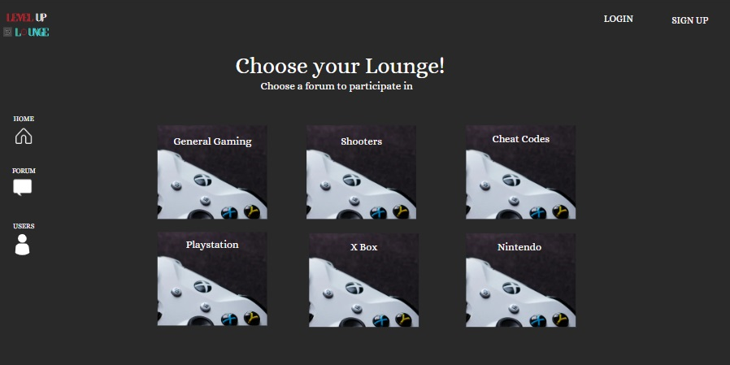

Level-Up-Lounge
Created by Victor Nieves, Josiah Tuvek, Charles Mendenhall, Cheik Bagagnan.
MERN Stack single-page web application using React and MongoDB.

Technologies Used: Node, Vite, ApolloClient, React, React Router Dom, GraphQL, Express, Mongoose

GitHub Repo:
https://github.com/jtuvek/Level-Up-Lounge
